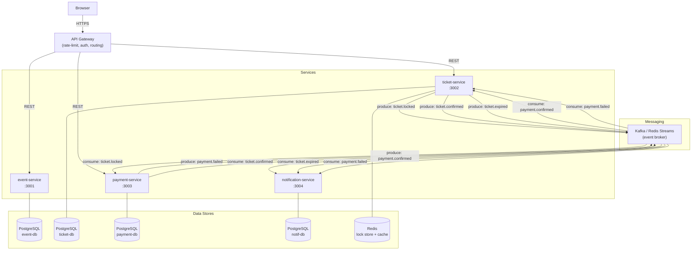

# War Tiket Konser — Kelompok 5

> Sistem penjualan tiket konser dengan antrean virtual dan kursi terbatas.

## Tim

| Nama | NIM | Peran |
|---|---|---|
| Miftahul Jannah | 105841116023 | Arsitek Sistem |
| Ashabul Kahfi | 105841108523 | Backend/API Engineer |
| Jusriadi Liwang | 105841117023 | Data & Persistence Engineer |
| Marhepi Rahmadani | 105841109523 | QA, Load-Test & Dokumentasi |

## Arsitektur



## Jalankan Sistem

```bash
# Clone repo
git clone <repo-url>
cd kelompok-5-tiket

# Jalankan semua service
docker compose up --build -d

# Cek status
docker compose ps

# Lihat log
docker compose logs -f
```

## URL Service

| Service | URL | Kegunaan |
|---|---|---|
| event-service | http://localhost:3001 | Katalog & manajemen konser |
| ticket-service | http://localhost:3002 | Kunci kursi & pesanan |
| payment-service | http://localhost:3003 | Pembayaran |
| notification-service | http://localhost:3004 | Notifikasi pengguna |
| RabbitMQ UI | http://localhost:15672 | Monitor message broker |

## Endpoint Kritis

Ini adalah endpoint yang menjadi bottleneck saat ramai:

| # | Method | Path | Service | Alasan Kritis |
|---|---|---|---|---|
| 1 | GET | /catalog | event-service:3001 | Dibuka semua orang sebelum sale |
| 2 | POST | /orders | ticket-service:3002 | **PALING KRITIS** — locking kursi |
| 3 | POST | /payments | payment-service:3003 | Transaksi keuangan |
| 4 | GET | /orders/:id | ticket-service:3002 | Polling status pesanan |
| 5 | GET | /events/:id/seats | event-service:3001 | Cek ketersediaan kursi real-time |

## Cara Pengujian Manual

### 1. Lihat katalog konser
```bash
curl http://localhost:3001/catalog
```

### 2. Kunci kursi (buat order)
```bash
curl -X POST http://localhost:3002/orders \
  -H "Content-Type: application/json" \
  -d '{"user_id":"user_001","event_id":1,"seat_category_id":2}'
```

### 3. Bayar tiket
```bash
curl -X POST http://localhost:3003/payments \
  -H "Content-Type: application/json" \
  -d '{"order_id":1,"user_id":"user_001","method":"gopay"}'
```

### 4. Cek notifikasi
```bash
curl "http://localhost:3004/notifications?user_id=user_001"
```

## Mekanisme Anti-Overselling

Sistem menggunakan **strategi kunci ganda** di `ticket-service`:

1. **Redis SET NX** — distributed lock (10 detik) mencegah race condition antar pod
2. **PostgreSQL FOR UPDATE** — atomic pada level database
3. **Decrement atomic** di `event-service` menggunakan transaksi DB

Urutan eksekusi saat `POST /orders`:
```
Request masuk
    → Cek duplikasi order (cegah order ganda)
    → Acquire Redis lock (cegah race condition)
    → PATCH event-service/seats/decrement (kurangi kursi tersedia)
    → INSERT order ke ticket_db
    → Release Redis lock
    → Publish "order.created" ke RabbitMQ
```

## Database Schema

### event_db
- `events` — Data konser (nama, venue, tanggal, status)
- `seat_categories` — Kategori kursi (VVIP/VIP/Festival, harga, jumlah)

### ticket_db
- `orders` — Pesanan dengan status locked/confirmed/cancelled/expired
- `tickets` — Tiket resmi setelah pembayaran dikonfirmasi

### payment_db
- `payments` — Record pembayaran dengan metode & status

### notification_db
- `notifications` — Notifikasi per user (e-ticket, gagal bayar, dll)
