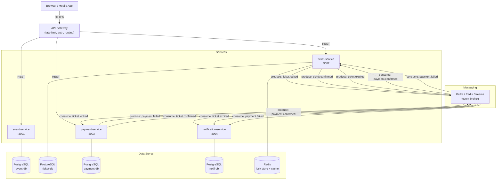
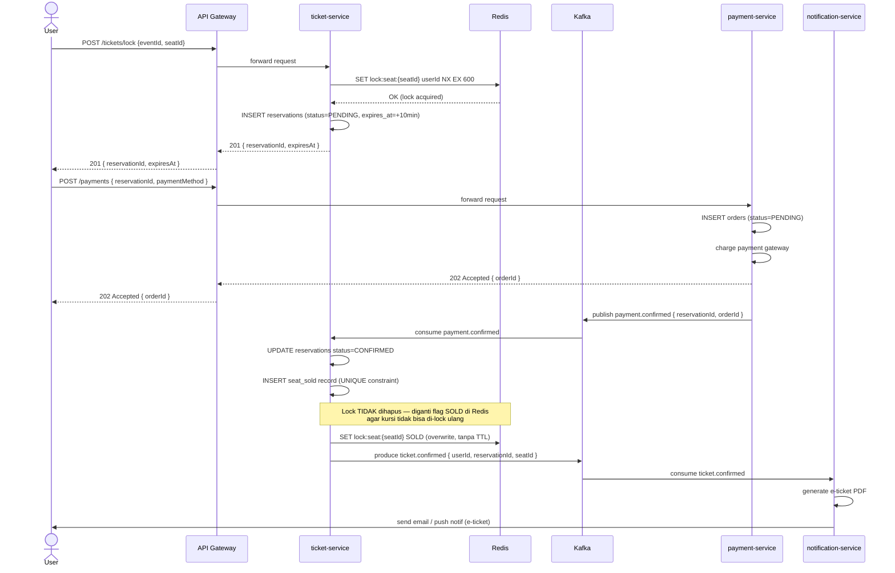
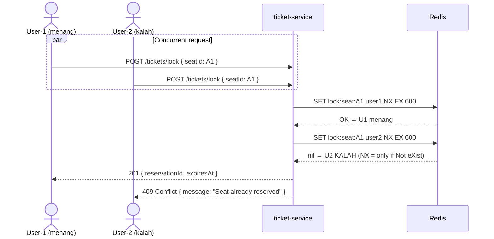
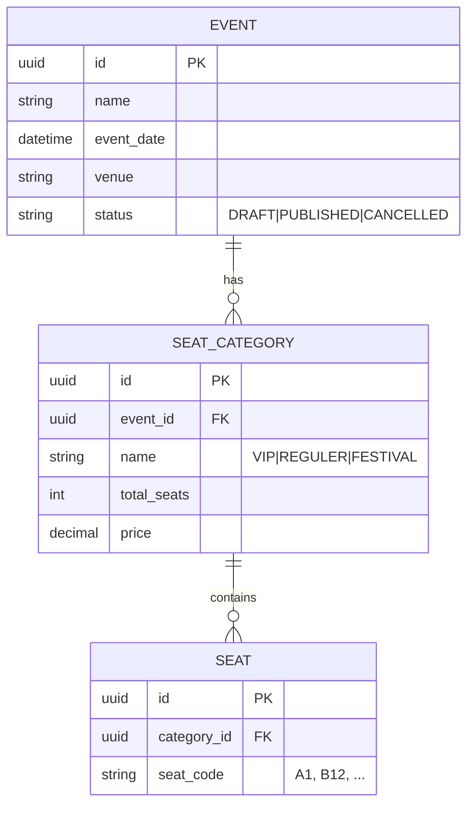
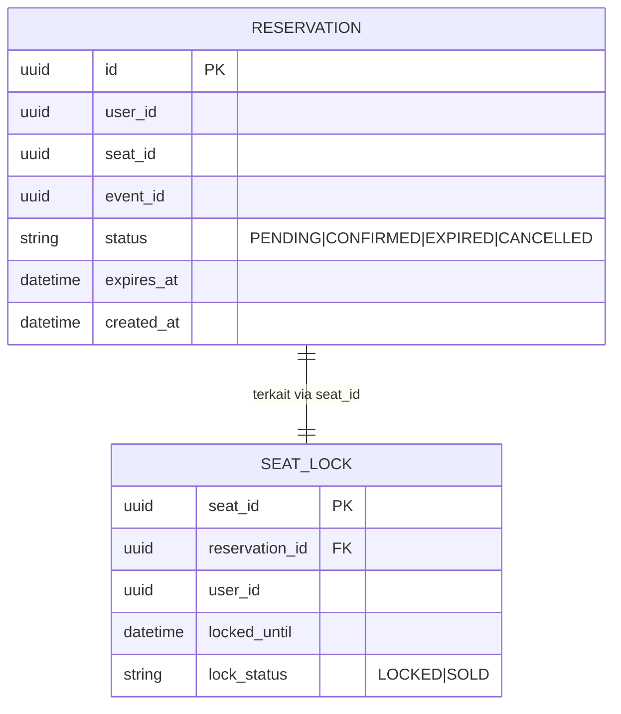
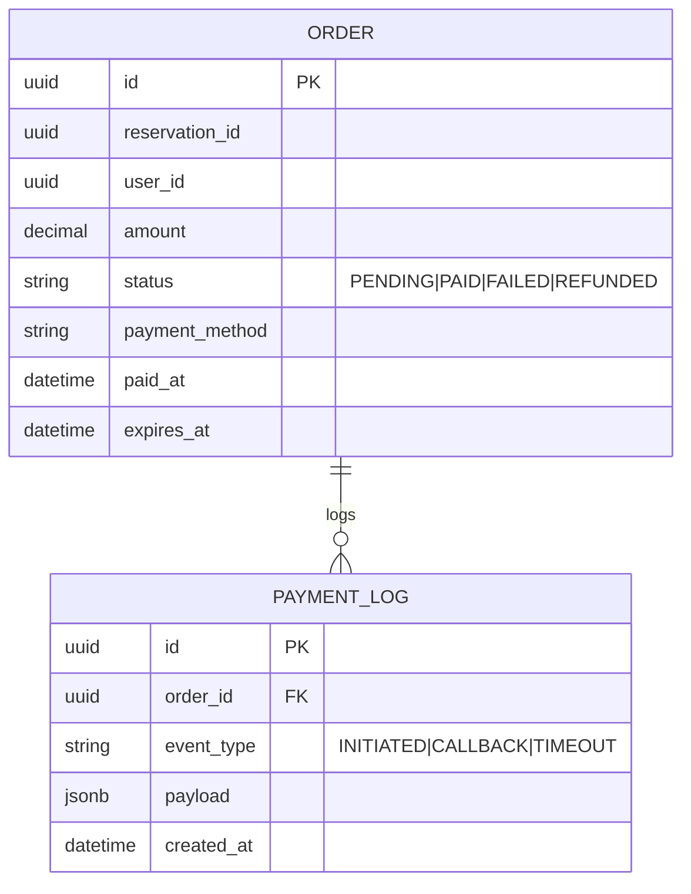
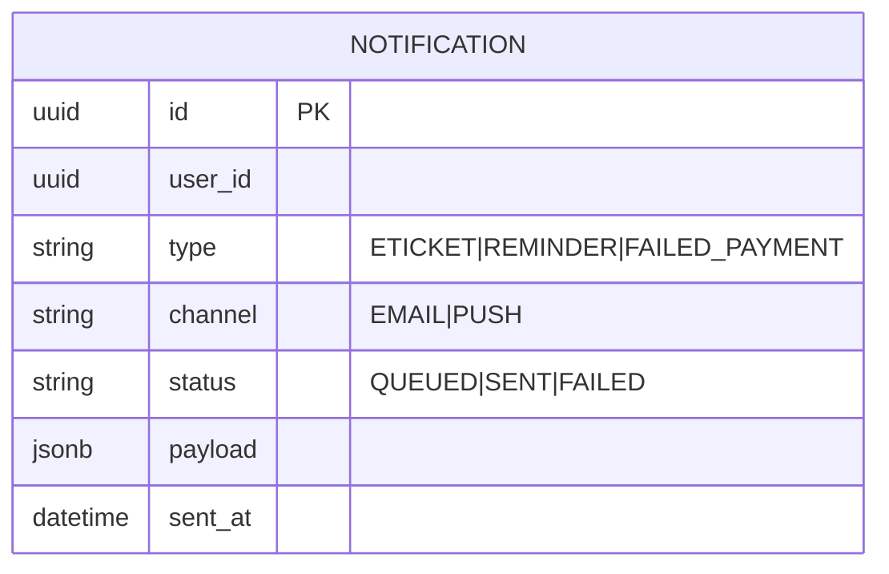

# Arsitektur Sistem — War Tiket Konser

**Stack:** Node.js / TypeScript  
**Style:** Microservices  
**Format:** Markdown + Mermaid  

---

## 1. System Overview & Service Boundaries

| Service | Tanggung Jawab | Database | Store Tambahan |
|---|---|---|---|
| `event-service` | Kelola konser, jadwal, kategori kursi, harga | PostgreSQL | — |
| `ticket-service` | Kunci kursi sementara, konfirmasi, lepas kunci | PostgreSQL | Redis |
| `payment-service` | Terima, konfirmasi, batalkan pembayaran | PostgreSQL | — |
| `notification-service` | Email/push e-ticket, pengingat, gagal bayar | PostgreSQL | — |
| `api-gateway` | Auth, rate-limit, routing | — | Redis |
| `queue (broker)` | Decouple service via async events | — | Kafka / Redis Streams |

**Prinsip:**
- Setiap service punya **database sendiri** (database per service pattern) — tidak ada shared table.
- Komunikasi **sinkron** hanya untuk operasi yang butuh respons langsung (lock kursi, buat order).
- Komunikasi **asinkron** (event) untuk notifikasi, pembayaran konfirmasi, dan pembatalan.

---

## 2. Architecture Diagram



---

## 3. Sequence Diagram — Happy Path



---

## 4. Sequence Diagram — Race Condition (1000 User, 1 Kursi)



**Kunci desain:**
- `SET key value NX EX ttl` adalah operasi **atomic** di Redis — hanya satu yang bisa sukses walau ribuan request bersamaan.
- Kalau User-1 tidak bayar dalam 10 menit → Redis key expired → kursi otomatis bebas kembali.

---

## 5. Data Model / ERD Per Service

### event-service



### ticket-service



> `SEAT_LOCK` adalah bayangan DB dari Redis lock. Sumber kebenaran tetap di Redis.  
> Kolom `lock_status` membedakan kursi yang sedang dipesan (`LOCKED`) vs sudah terjual (`SOLD`).  
> Relasi ke `RESERVATION` via `reservation_id` memastikan lock selalu punya konteks reservasi yang valid.

### payment-service



### notification-service



---

## 6. API Contract

### ticket-service (REST)

| Method | Path | Request Body | Response | Keterangan |
|---|---|---|---|---|
| `GET` | `/events/:id/seats` | — | `[{ seatId, code, status, price }]` | Lihat ketersediaan kursi |
| `POST` | `/tickets/lock` | `{ eventId, seatId, userId }` | `201 { reservationId, expiresAt }` | Kunci kursi 10 menit |
| `DELETE` | `/tickets/lock/:reservationId` | — | `204` | Lepas kunci manual |
| `GET` | `/tickets/:reservationId` | — | `{ status, seatId, expiresAt }` | Cek status reservasi |

### payment-service (REST)

| Method | Path | Request Body | Response |
|---|---|---|---|
| `POST` | `/payments` | `{ reservationId, paymentMethod, amount }` | `202 { orderId }` |
| `GET` | `/payments/:orderId` | — | `{ status, paidAt }` |
| `POST` | `/payments/:orderId/cancel` | — | `200` |

### Event Schema (Kafka Topics)

```json
// Topic: ticket.locked
{
  "reservationId": "uuid",
  "userId": "uuid",
  "seatId": "uuid",
  "eventId": "uuid",
  "expiresAt": "ISO8601"
}

// Topic: payment.confirmed
{
  "orderId": "uuid",
  "reservationId": "uuid",
  "userId": "uuid",
  "paidAt": "ISO8601"
}

// Topic: payment.failed
{
  "orderId": "uuid",
  "reservationId": "uuid",
  "reason": "TIMEOUT|DECLINED"
}

// Topic: ticket.confirmed
{
  "reservationId": "uuid",
  "userId": "uuid",
  "seatCode": "A1",
  "eventName": "string",
  "eventDate": "ISO8601",
  "eticketUrl": "string"
}
```

---

## 7. ADR (Architecture Decision Records)

### ADR-001 — Redis `SET NX EX` sebagai Distributed Lock untuk Kursi

**Status:** Accepted

**Konteks:**  
Ratusan ribu request bersamaan memperebutkan kursi yang sama. Database row-level lock saja tidak cukup efisien karena bottleneck pada connection pool PostgreSQL.

**Keputusan:**  
Gunakan Redis atomic command `SET lock:seat:{seatId} {userId} NX EX 600` sebagai first-line guard. Hanya jika Redis lock berhasil, data ditulis ke PostgreSQL.

**Konsekuensi:**
- (+) O(1) per request, sangat cepat, atomic secara native.
- (+) TTL otomatis melepas kursi bila pembayaran tidak selesai.
- (-) Redis menjadi single point of failure → mitigasi: Redis Sentinel / Cluster.
- (-) Bila Redis crash sebelum DB ditulis → reservasi hilang, tapi kursi tidak terjual (aman, sisi conservative).

---

### ADR-002 — Database per Service (No Shared DB)

**Status:** Accepted

**Konteks:**  
Empat service dengan domain yang berbeda; coupling melalui shared DB menyebabkan deployment coupling dan schema conflict.

**Keputusan:**  
Setiap service punya database PostgreSQL sendiri. Cross-service data diperoleh via event atau API call, bukan JOIN.

**Konsekuensi:**
- (+) Deploy independen, schema evolve sendiri.
- (-) Tidak ada distributed transaction → kompensasi dengan **Saga pattern** (lihat ADR-004).

---

### ADR-003 — Kafka untuk Async Communication

**Status:** Accepted

**Konteks:**  
`ticket-service` tidak harus menunggu notifikasi email terkirim. Pembayaran juga prosesnya async dengan payment gateway.

**Keputusan:**  
Gunakan Kafka (atau Redis Streams untuk skala lebih kecil) untuk event `payment.confirmed`, `ticket.confirmed`, `payment.failed`, dll.

**Konsekuensi:**
- (+) Services decoupled; `notification-service` bisa down tanpa mengganggu ticketing.
- (+) Replay events untuk audit/recovery.
- (-) Eventually consistent — user mungkin perlu polling status order sebentar.

---

### ADR-004 — Saga Pattern (Choreography) untuk Koordinasi Antar Service

**Status:** Accepted

**Konteks:**  
Alur: lock kursi → bayar → konfirmasi kursi → kirim e-ticket melibatkan 4 service. Gagal di tengah harus ada rollback.

**Keputusan:**  
Gunakan **Choreography-based Saga** via events:
- `payment.failed` → `ticket-service` melepas kunci kursi, status `CANCELLED`.
- Reservation TTL expired → `ticket-service` publish `ticket.expired` → `notification-service` kirim notif.

**Konsekuensi:**
- (+) Tidak ada central orchestrator → lebih resilient.
- (-) Alur lebih sulit di-trace → mitigasi: correlation ID di setiap event, gunakan distributed tracing (Jaeger/OpenTelemetry).

---

### ADR-005 — Rate Limiting di API Gateway

**Status:** Accepted

**Konteks:**  
War tiket = ribuan request per detik dari user yang sama (bot, spam klik).

**Keputusan:**  
API Gateway menerapkan rate limit per user (misal: 10 req/s untuk endpoint `/tickets/lock`) menggunakan **sliding window counter** di Redis.

**Konsekuensi:**
- (+) Melindungi backend dari abuse.
- (+) Fairness — user biasa tidak kalah dari bot.
- (-) User legitimate yang koneksinya buruk (retry cepat) bisa kena limit → nilai threshold harus di-tune.

---

## 8. Konsistensi Desain & Edge Cases

| Skenario | Penanganan |
|---|---|
| User lock kursi, tidak bayar 10 menit | Redis TTL expired → `ticket-service` mendeteksi via scheduler/TTL listener → status `EXPIRED`, kursi bebas |
| Payment gateway timeout | `payment-service` TTL order → publish `payment.failed` → Saga rollback |
| Redis mati saat lock | Fallback: PostgreSQL `SELECT FOR UPDATE SKIP LOCKED` sebagai secondary guard |
| User double-click beli | Idempotency key di header request → `ticket-service` return reservasi yang sudah ada |
| `notification-service` down | Kafka retain pesan → service consume saat recovery (at-least-once delivery) |
| Oversell (bug) | Constraint `UNIQUE` pada `seat_sold(seat_id)` di PostgreSQL sebagai last-resort guard |
| Correlation & tracing | Setiap request inject `X-Correlation-ID`, diteruskan ke semua event payload |

---

## Ringkasan: Lapisan Perlindungan Anti-Oversell

```
Request masuk
    → Rate Limit (API Gateway / Redis)          [layer 1: fairness & anti-bot]
    → SET NX EX (Redis distributed lock)        [layer 2: concurrency guard, atomic]
    → INSERT reservation (PostgreSQL)            [layer 3: persistence]
    → UNIQUE seat_sold constraint (PostgreSQL)   [layer 4: last-resort oversell guard]
```

Empat lapisan ini memastikan satu kursi hanya bisa terjual satu kali walau terdapat ribuan permintaan bersamaan atau terjadi bug di salah satu lapisan.
