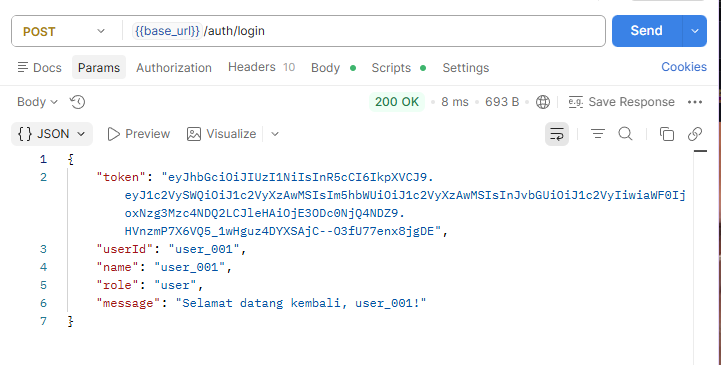
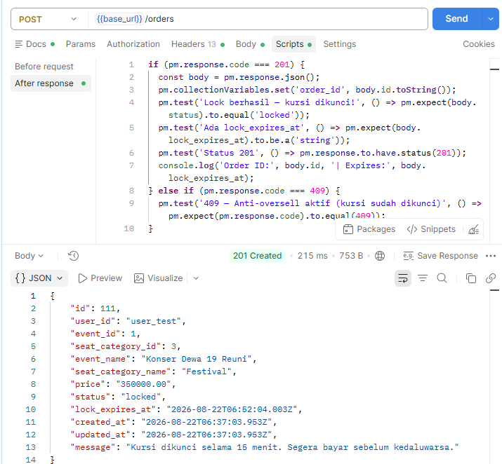
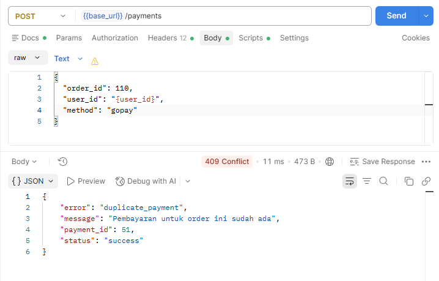
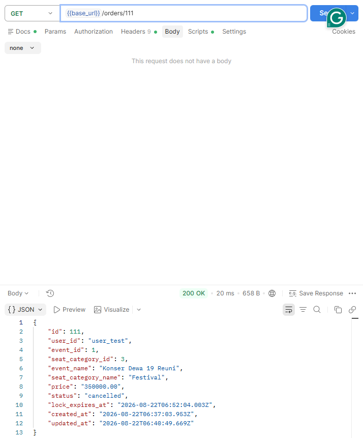
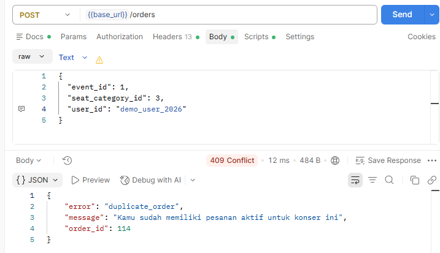

# 📄 Dokumentasi Kontribusi Individu
## Ashabul Kahfi — Backend / API Engineer
**NIM:** 105841108523  
**Kelompok:** 5 | Praktikum Microservices  
**Universitas:** Muhammadiyah Makassar  
**GitHub:** [@Kahfi10](https://github.com/Kahfi10)  
**Repository:** https://github.com/Jusriadiliwang/Lab-kelompok-05-tiket

---

## 👤 Profil Peran

| Atribut | Detail |
|---|---|
| **Peran Utama** | Backend / API Engineer |
| **Tanggung Jawab** | Logika bisnis, integrasi antar service, API Gateway, ERP Back-Office, Frontend lanjutan |
| **Total Commit** | 16+ commit sebagai author utama |
| **Stack** | Node.js, Express.js, RabbitMQ, Redis, PostgreSQL, Docker, React Native (Expo) |

---

## 🏗️ Kontribusi Berdasarkan Commit Nyata

### Microservices & Backend

| Commit | Deskripsi |
|---|---|
| `5bb915d` | `feat: add api-gateway` — JWT auth, Redis rate-limit, routing |
| `323ce0e` | `feat: implement payment confirmation and failure consumers` |
| `3176a0c` | `feat: implement payment and ticket event consumers with audit logging` |
| `13d5edf` | `feat: add ERP back-office service (M1-M6)` — RBAC, audit trail, snapshot sync |
| `c4fe027` | `fix: correct ERP seed, PostgreSQL constraint, api-gateway public routes` |
| `246b9eb` | `feat: add Redis response cache for GET /catalog (TTL 5s)` |
| `a68bc3c` | `feat(erp): implement all missing ERP features` |

### Frontend Web

| Commit | Deskripsi |
|---|---|
| `87e7e1e` | `fix(frontend): fix all bugs and integrate with ERP service` |
| `132fd2d` | `fix(frontend): fix JS syntax error — saveNewEvent must be async` |
| `bf65643` | `feat(frontend): add Tiket Saya modal with QR, Notifikasi bell+modal, fix banner URLs` |
| `987b32d` | `fix(frontend): fix all emoji issues, improve UI, fix banner images` |
| `3ed443a` | `feat(frontend): add 6 new events + 3 homepage sections` |
| `d59d63e` | `feat(frontend): add content to footer links` |

### Mobile App (Expo)

| Commit | Deskripsi |
|---|---|
| `40fbab2` | `feat: add Profile, Queue, Register screens` — auth, order management |
| `87313a9` | `Add design assets and guidelines for Monochrome Concert Pulse` |

### Dokumentasi & Laporan

| Commit | Deskripsi |
|---|---|
| `e4b10cd` | `docs: add LAPORAN.md` — laporan gabungan tiga lapisan |
| `e0f6525` | `docs: add SKRIP_VIDEO.md` — skrip narasi demo |
| `c37b6dc` | `feat: update openapi.yaml v2` + load-test.js |
| `87ec272` | `chore: remove load-test.js from repo` |
| `7619bc7` | `docs: add KONTRIBUSI.md` — dokumentasi kontribusi nyata |

---

## 📋 API Gateway (Port 3000)

| Fitur | Implementasi |
|---|---|
| **JWT Authentication** | Middleware `auth.js` — verifikasi token semua request |
| **Rate Limiting** | Redis sliding-window — `POST /orders`: 10 req/10s |
| **Response Cache** | Redis TTL 5s — `GET /catalog` |
| **Routing** | Proxy ke semua 5 service |
| **Auth Register/Login** | `POST /auth/register`, `POST /auth/login` dengan Redis user store |
| **ERP Route** | `GET /erp/*` → erp-service :3005 |

---

## ⚙️ ERP Back-Office (Port 3005) — 6 Modul

| Modul | Fungsi |
|---|---|
| M1 | Manajemen Event — CRUD, publish/cancel |
| M2 | Inventory Kursi — real-time, hold manual |
| M3 | Keuangan & Revenue — rekap, export CSV, refund |
| M4 | Analitik — conversion rate, drop-off, dashboard live |
| M5 | RBAC — login admin, kelola akun, 5 role |
| M6 | Audit Trail — immutable log semua aksi + business events |

---

## 📊 Statistik Commit

| Metrik | Nilai |
|---|---|
| Total commit (author) | **16+ commit** |
| File utama | `api-gateway/`, `erp-service/`, `consumers/`, `jobs/`, `frontend/index.html` |
| Peran tambahan | Mobile App (Expo), Frontend Web lanjutan |

---

## 🧪 Dokumentasi & Pengujian API (Postman)

Seluruh endpoint backend didokumentasikan dan diuji menggunakan **Postman**. Berikut bukti pengujian 5 endpoint kritis:

---

### 1. Login — `POST /auth/login`

**Request:**
```
POST http://localhost:3000/auth/login
Body: {"userId": "user_001"}
```

**Response (200 OK):**
```json
{
  "token": "eyJhbGciOiJIUzI1NiIsInR5cCI6IkpXVCJ9...",
  "userId": "user_001",
  "role": "user",
  "message": "Selamat datang kembali, user_001!"
}
```



---

### 2. Lock Kursi — `POST /orders` (Redis NX EX — ADR-001)

**Request:**
```
POST http://localhost:3000/orders
Authorization: Bearer <token>
Body: {"event_id": 1, "seat_category_id": 3, "user_id": "user_test"}
```

**Response (201 Created):**
```json
{
  "id": 110,
  "event_name": "Konser Dewa 19 Reuni",
  "seat_category_name": "Festival",
  "price": "350000.00",
  "status": "locked",
  "lock_expires_at": "2026-08-22T06:03:52.279Z",
  "message": "Kursi dikunci selama 15 menit."
}
```



---

### 3. Bayar Tiket — `POST /payments` (Saga RabbitMQ — ADR-004)

**Request:**
```
POST http://localhost:3000/payments
Authorization: Bearer <token>
Body: {"order_id": 110, "user_id": "user_test", "method": "gopay"}
```

**Response (201 Created):**
```json
{
  "id": 51,
  "amount": "350000.00",
  "method": "gopay",
  "status": "success",
  "paid_at": "2026-08-22T05:49:09.019Z",
  "message": "Pembayaran berhasil! E-tiket akan segera dikirim."
}
```

> Setelah pembayaran sukses, sistem otomatis:
> 1. Publish `payment.confirmed` → **RabbitMQ**
> 2. `ticket-service` consume → UPDATE order `status=confirmed`
> 3. `notification-service` consume → kirim e-ticket



---

### 4. Konfirmasi Order — `GET /orders/:id`

**Request:**
```
GET http://localhost:3000/orders/110
Authorization: Bearer <token>
```

**Response (200 OK) — status berubah dari `locked` → `confirmed`:**
```json
{
  "id": 110,
  "status": "confirmed",
  "event_name": "Konser Dewa 19 Reuni",
  "seat_category_name": "Festival"
}
```



---

### 5. Anti-Oversell — `POST /orders` (409 Conflict)

Bukti Redis `SET NX EX` mencegah double-booking. User lain mencoba lock kursi yang sudah dikunci:

**Response (409 Conflict):**
```json
{
  "error": "duplicate_order",
  "message": "Kamu sudah memiliki pesanan aktif untuk konser ini"
}
```



---

### File Collection Postman

File collection tersedia untuk diimport langsung:

| File | Keterangan |
|---|---|
| [`docs/api-test/WarTiket-PostmanCollection.json`](../api-test/WarTiket-PostmanCollection.json) | 7 folder, 15 endpoint, auto-save token |
| [`docs/api-test/WarTiket-ThunderClient.json`](../api-test/WarTiket-ThunderClient.json) | Untuk Thunder Client (VS Code) |

---

*Dokumen ini merupakan bagian dari laporan praktikum Microservices Kelompok 5 — Universitas Muhammadiyah Makassar.*
