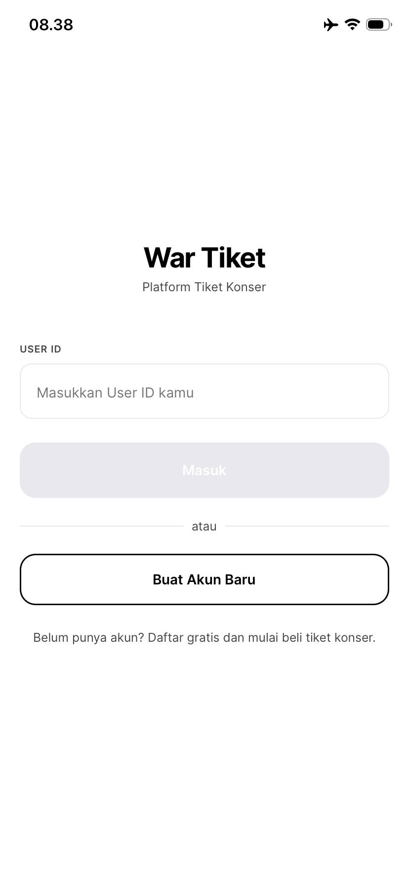
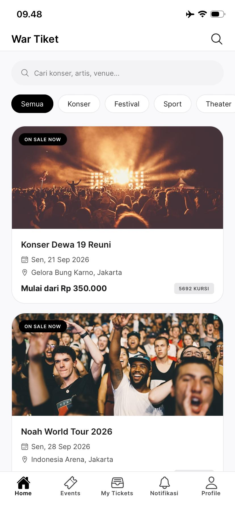
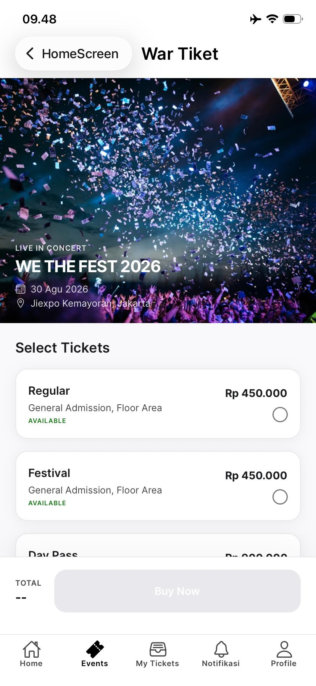
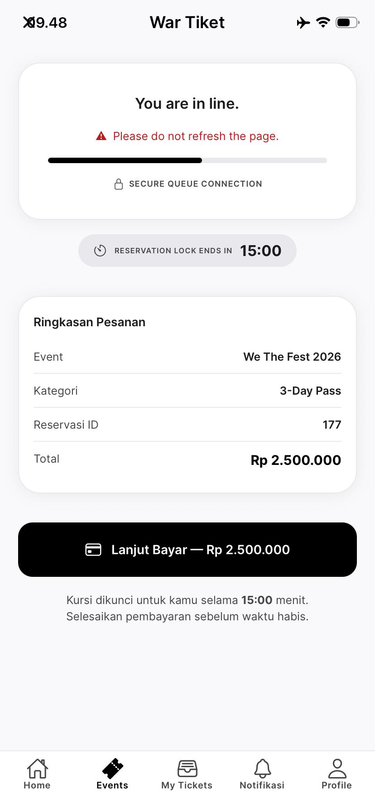
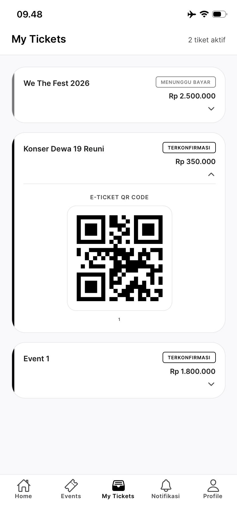

# Dokumentasi Mobile App — War Tiket Konser
**Penulis:** Marhepi Rahmadani (105841109523)  
**Kelompok:** 5 | Universitas Muhammadiyah Makassar  
**Framework:** Expo SDK 54 + React Native + TypeScript  
**Diuji pada:** iPhone (Expo Go) & Web Browser  
**Tanggal:** 25 Agustus 2026

---

## Gambaran Umum

War Tiket Mobile adalah aplikasi mobile yang dibangun dengan **Expo React Native** sebagai client tambahan untuk sistem War Tiket Konser. Aplikasi terhubung langsung ke **API Gateway** (`http://10.126.205.34:3000`) yang menghubungkan semua microservice.

### Arsitektur Koneksi
```
iPhone (Expo Go)
       │
       ▼ IP WiFi Laptop
  API Gateway :3000
       │
  ┌────┼────────────┐
  ▼    ▼            ▼
event  ticket    payment
:3001  :3002     :3003
```

### Stack Teknologi
| Komponen | Teknologi |
|---|---|
| Framework | Expo SDK 54 |
| Bahasa | TypeScript |
| UI | React Native + custom theme |
| Navigasi | React Navigation (Bottom Tab + Stack) |
| HTTP Client | Axios + JWT interceptor |
| State | React Context (AuthContext) |
| Storage | AsyncStorage |

---

## Fitur & Tampilan

---

### 1. Login Screen

Halaman pertama yang muncul saat membuka aplikasi. User memasukkan **User ID** untuk login atau memilih **Buat Akun Baru** untuk register.

**Fitur:**
- Input User ID
- Tombol Masuk → `POST /auth/login`
- Tombol Buat Akun Baru → navigasi ke Register Screen
- Token JWT disimpan otomatis di AsyncStorage



---

### 2. Home Screen — Daftar Event

Halaman utama setelah login. Menampilkan semua event konser yang sedang dijual.

**Fitur:**
- Header "War Tiket" dengan search icon
- Search bar real-time
- Filter kategori: Semua · Konser · Festival · Sport · Theater · Comedy
- Event card: gambar, nama, tanggal, venue, harga mulai, jumlah kursi tersedia
- Pull-to-refresh
- Data dari `GET /catalog` (di-cache Redis 5 detik — ADR-001)



---

### 3. Event Detail — Pilih Kursi

Halaman detail event setelah klik salah satu event card. User memilih kategori kursi sebelum melakukan pembelian.

**Fitur:**
- Hero image konser full-width
- Informasi event: nama, tanggal, venue
- ERP Live Stats: kursi terjual, tersedia, conversion rate (dari `/erp/analytics`)
- Daftar kategori kursi dengan harga (VIP / Festival / VVIP)
- Radio button pilihan kategori
- Sticky bottom bar: Total harga + tombol "Buy Now"
- Tombol aktif (hitam) setelah kategori dipilih



---

### 4. Queue Screen — Antrian & Countdown

Halaman antrian yang muncul setelah klik "Buy Now". Sistem mengunci kursi menggunakan **Redis `SET NX EX`** (ADR-001).

**Fitur:**
- Animasi progress bar "You are in line"
- Countdown timer 15 menit (kursi kadaluarsa otomatis)
- Ringkasan pesanan: nama event, kategori, harga
- Polling status order setiap 3 detik (`GET /orders/:id`)
- Tombol "Lanjut Bayar" → navigasi ke Checkout Screen
- Jika waktu habis → alert & kursi dilepas otomatis (Saga rollback)



---

### 5. My Tickets — Tiket & QR Code

Halaman daftar semua pesanan user. Tiket yang terkonfirmasi menampilkan **QR code** untuk masuk venue.

**Fitur:**
- Daftar semua order dengan status badge
- Status: **Terkonfirmasi** / Menunggu Bayar / Kedaluwarsa / Dibatalkan
- Klik order → expand detail + QR Code e-ticket
- Tombol "Batalkan Pesanan" untuk order yang masih LOCKED
- Pull-to-refresh
- Data dari `GET /orders?user_id=...`



---

## Alur Penggunaan Lengkap

```
Buka App
    ↓
Login (masukkan User ID)
    ↓ POST /auth/login → JWT token
Home Screen
    ↓ GET /catalog (Redis cache 5s)
Pilih Event → Event Detail
    ↓ GET /events/:id/seats
Pilih Kategori Kursi → Buy Now
    ↓ POST /orders (Redis NX EX lock)
Queue Screen — countdown 15 menit
    ↓ Tap "Lanjut Bayar"
Checkout Screen — pilih metode bayar
    ↓ POST /payments → Saga RabbitMQ
Order Confirmation — QR Code ✅
    ↓
My Tickets — lihat semua tiket + QR
```

---

## Cara Menjalankan

### Prasyarat
```bash
# 1. Pastikan backend berjalan
cd Lab-kelompok-05-tiket
docker compose up -d

# 2. Pastikan HP dan laptop satu WiFi
```

### Jalankan Expo
```bash
cd mobile
npx expo start
```

### Buka di iPhone
1. Install **Expo Go** dari App Store
2. Scan QR code dari terminal
3. Atau ketik manual di Expo Go: `exp://10.126.205.34:8081`

### Buka di Browser
```
http://localhost:8081
```

---

## Konfigurasi IP

App otomatis mendeteksi environment:

| Environment | URL API |
|---|---|
| Web Browser (laptop) | `http://localhost:3000` |
| iPhone / Android fisik | `http://10.126.205.34:3000` |

> Ganti IP `10.126.205.34` dengan IP WiFi laptop kamu.  
> Cek: `ipconfig` (Windows) → cari IPv4 Address di WiFi adapter.

---

## Struktur Folder

```
mobile/
├── App.tsx                    ← Entry point
├── app.json                   ← Expo config (SDK 54)
└── src/
    ├── api/
    │   ├── client.ts          ← Axios + JWT + auto IP detection
    │   ├── auth.ts            ← Login, Register
    │   ├── events.ts          ← Catalog, Event detail, Seats
    │   ├── tickets.ts         ← Lock kursi, Orders
    │   ├── payments.ts        ← Bayar, Refund
    │   └── notifications.ts   ← Notifikasi user
    ├── context/
    │   └── AuthContext.tsx    ← JWT state + AsyncStorage
    ├── navigation/
    │   └── index.tsx          ← Bottom Tab + Stack navigator
    ├── screens/
    │   ├── LoginScreen.tsx
    │   ├── RegisterScreen.tsx
    │   ├── HomeScreen.tsx
    │   ├── EventDetailScreen.tsx
    │   ├── QueueScreen.tsx
    │   ├── CheckoutScreen.tsx
    │   ├── OrderConfirmationScreen.tsx
    │   ├── MyTicketsScreen.tsx
    │   ├── NotificationsScreen.tsx
    │   └── ProfileScreen.tsx
    ├── theme.ts               ← Design tokens (Monochrome Concert Pulse)
    ├── types/index.ts         ← TypeScript types
    └── utils/helpers.ts       ← Format date, price, error messages
```

---

*Dokumen ini merupakan bagian dari laporan praktikum Microservices Kelompok 5 — Universitas Muhammadiyah Makassar.*
