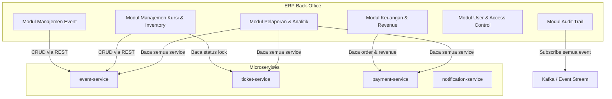
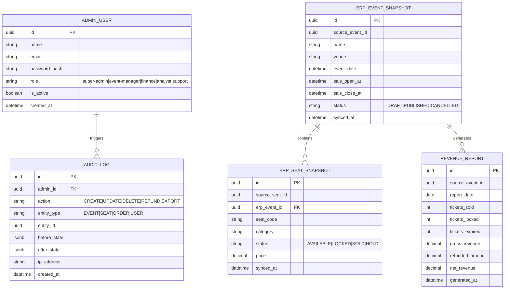

# Struktur, ERP & Tasks — War Tiket Konser

---

## 1. Struktur Folder Proyek (Monorepo)

```
concert-ticketing/
├── apps/
│   ├── api-gateway/                  # Entry point semua request client
│   │   ├── src/
│   │   │   ├── middleware/
│   │   │   │   ├── auth.middleware.ts
│   │   │   │   ├── rate-limit.middleware.ts
│   │   │   │   └── correlation-id.middleware.ts
│   │   │   ├── proxy/
│   │   │   │   ├── event.proxy.ts
│   │   │   │   ├── ticket.proxy.ts
│   │   │   │   └── payment.proxy.ts
│   │   │   └── main.ts
│   │   ├── Dockerfile
│   │   └── package.json
│   │
│   ├── event-service/                # Kelola konser, kursi, harga
│   │   ├── src/
│   │   │   ├── modules/
│   │   │   │   ├── event/
│   │   │   │   │   ├── event.controller.ts
│   │   │   │   │   ├── event.service.ts
│   │   │   │   │   ├── event.repository.ts
│   │   │   │   │   └── event.entity.ts
│   │   │   │   ├── seat-category/
│   │   │   │   │   ├── seat-category.controller.ts
│   │   │   │   │   ├── seat-category.service.ts
│   │   │   │   │   └── seat-category.entity.ts
│   │   │   │   └── seat/
│   │   │   │       ├── seat.controller.ts
│   │   │   │       ├── seat.service.ts
│   │   │   │       └── seat.entity.ts
│   │   │   ├── database/
│   │   │   │   └── migrations/
│   │   │   └── main.ts
│   │   ├── Dockerfile
│   │   └── package.json
│   │
│   ├── ticket-service/               # Lock, konfirmasi, expire kursi
│   │   ├── src/
│   │   │   ├── modules/
│   │   │   │   ├── reservation/
│   │   │   │   │   ├── reservation.controller.ts
│   │   │   │   │   ├── reservation.service.ts
│   │   │   │   │   ├── reservation.repository.ts
│   │   │   │   │   └── reservation.entity.ts
│   │   │   │   └── seat-lock/
│   │   │   │       ├── seat-lock.service.ts   # Redis NX EX logic
│   │   │   │       └── seat-lock.repository.ts
│   │   │   ├── jobs/
│   │   │   │   └── expire-reservation.job.ts  # Cron: lepas kunci kedaluwarsa
│   │   │   ├── consumers/
│   │   │   │   ├── payment-confirmed.consumer.ts
│   │   │   │   └── payment-failed.consumer.ts
│   │   │   ├── producers/
│   │   │   │   ├── ticket-locked.producer.ts
│   │   │   │   ├── ticket-confirmed.producer.ts
│   │   │   │   └── ticket-expired.producer.ts
│   │   │   ├── database/
│   │   │   │   └── migrations/
│   │   │   └── main.ts
│   │   ├── Dockerfile
│   │   └── package.json
│   │
│   ├── payment-service/              # Order, bayar, refund
│   │   ├── src/
│   │   │   ├── modules/
│   │   │   │   ├── order/
│   │   │   │   │   ├── order.controller.ts
│   │   │   │   │   ├── order.service.ts
│   │   │   │   │   ├── order.repository.ts
│   │   │   │   │   └── order.entity.ts
│   │   │   │   └── payment-log/
│   │   │   │       ├── payment-log.service.ts
│   │   │   │       └── payment-log.entity.ts
│   │   │   ├── jobs/
│   │   │   │   └── expire-order.job.ts        # Cron: batalkan order lewat batas waktu
│   │   │   ├── consumers/
│   │   │   │   └── ticket-locked.consumer.ts
│   │   │   ├── producers/
│   │   │   │   ├── payment-confirmed.producer.ts
│   │   │   │   └── payment-failed.producer.ts
│   │   │   ├── gateway/
│   │   │   │   └── payment-gateway.adapter.ts # Midtrans / Stripe adapter
│   │   │   ├── database/
│   │   │   │   └── migrations/
│   │   │   └── main.ts
│   │   ├── Dockerfile
│   │   └── package.json
│   │
│   └── notification-service/         # Email, push, e-ticket
│       ├── src/
│       │   ├── modules/
│       │   │   └── notification/
│       │   │       ├── notification.service.ts
│       │   │       ├── notification.repository.ts
│       │   │       └── notification.entity.ts
│       │   ├── jobs/
│       │   │   └── retry-failed-notif.job.ts  # Cron: retry notif gagal
│       │   ├── consumers/
│       │   │   ├── ticket-confirmed.consumer.ts
│       │   │   ├── ticket-expired.consumer.ts
│       │   │   └── payment-failed.consumer.ts
│       │   ├── channels/
│       │   │   ├── email.channel.ts           # nodemailer / SendGrid
│       │   │   └── push.channel.ts            # Firebase FCM
│       │   ├── templates/
│       │   │   ├── eticket.html
│       │   │   ├── reminder.html
│       │   │   └── failed-payment.html
│       │   └── main.ts
│       ├── Dockerfile
│       └── package.json
│
├── packages/                         # Shared library (monorepo)
│   ├── shared-types/                 # DTO, interface, enum bersama
│   │   └── src/
│   │       ├── events/               # Kafka event schema types
│   │       ├── dto/
│   │       └── enums/
│   ├── shared-config/                # Env loader, config schema
│   └── shared-utils/                 # Logger, correlation ID, error handler
│
├── infra/
│   ├── docker-compose.yml            # Local dev: semua service + DB + Redis + Kafka
│   ├── docker-compose.prod.yml
│   ├── nginx/
│   │   └── nginx.conf                # Load balancer / reverse proxy
│   └── k8s/                          # Kubernetes manifests (opsional)
│       ├── event-service.yaml
│       ├── ticket-service.yaml
│       ├── payment-service.yaml
│       └── notification-service.yaml
│
├── docs/
│   ├── arsitektur-war-tiket-konser.md
│   ├── struktur-erp-tasks.md
│   └── adr/
│       ├── ADR-001-redis-lock.md
│       ├── ADR-002-db-per-service.md
│       ├── ADR-003-kafka-async.md
│       ├── ADR-004-saga-choreography.md
│       └── ADR-005-rate-limiting.md
│
├── turbo.json                        # Turborepo build pipeline
├── pnpm-workspace.yaml
└── package.json
```

---

## 2. ERP (Enterprise System) — Modul & Integrasi

ERP di sini adalah lapisan **back-office** yang digunakan oleh operator/admin konser untuk mengelola bisnis secara end-to-end. ERP terintegrasi dengan microservices melalui internal API dan event stream.

### 2.1 Peta Modul ERP



---

### 2.2 Modul ERP Detail

#### M1 — Manajemen Event
| Fitur | Deskripsi |
|---|---|
| Buat / edit konser | Nama, tanggal, venue, poster, deskripsi |
| Atur jadwal penjualan | Waktu buka penjualan, batas waktu |
| Publish / unpublish | Draft → Published → Cancelled |
| Kelola kategori kursi | VIP, Reguler, Festival + harga per kategori |

#### M2 — Manajemen Kursi & Inventory
| Fitur | Deskripsi |
|---|---|
| Upload denah kursi | Import CSV/JSON `seat_code`, `row`, `column` |
| Pantau status kursi real-time | AVAILABLE / LOCKED / SOLD per kursi |
| Hold kursi manual | Block kursi untuk sponsor / tamu VIP |
| Kapasitas & sisa kursi | Dashboard total, terjual, terkunci, tersedia |

#### M3 — Keuangan & Revenue
| Fitur | Deskripsi |
|---|---|
| Rekap pendapatan | Per event, per kategori, per periode |
| Status pembayaran | PENDING / PAID / FAILED / REFUNDED |
| Proses refund | Manual trigger refund ke payment gateway |
| Export laporan keuangan | CSV / XLSX untuk akunting |

#### M4 — Pelaporan & Analitik
| Fitur | Deskripsi |
|---|---|
| Dashboard penjualan live | Tiket terjual per menit saat war tiket |
| Conversion rate | Lock → Bayar → Konfirmasi |
| Drop-off analysis | Berapa % yang lock tapi tidak bayar |
| User behavior | Top jam pembelian, device, lokasi |

#### M5 — User & Access Control (RBAC)
| Role | Hak Akses |
|---|---|
| `super-admin` | Full akses semua modul |
| `event-manager` | M1, M2 (buat & edit event) |
| `finance` | M3 (baca & export keuangan, proses refund) |
| `analyst` | M4 (baca laporan, tidak bisa edit) |
| `support` | Baca status order user, proses refund manual |

#### M6 — Audit Trail
| Fitur | Deskripsi |
|---|---|
| Log semua aksi admin | Siapa, kapan, ubah apa, dari IP mana |
| Subscribe event Kafka | Rekam semua event bisnis (payment, lock, expire) |
| Immutable log | Tidak bisa dihapus, append-only |
| Export audit log | Untuk keperluan compliance |

---

### 2.3 ERD Modul ERP

> **Catatan penting (konsisten dengan ADR-002):**  
> ERP memiliki database **sendiri** (`erp-db`) yang terpisah dari `event-db`, `ticket-db`, dll.  
> ERP **tidak** melakukan JOIN langsung ke database microservice.  
> Data event/kursi di ERP diperoleh via REST API ke `event-service`, atau disinkronisasi secara async via event Kafka ke tabel lokal ERP (`ERP_EVENT_SNAPSHOT`).



> `ERP_EVENT_SNAPSHOT` dan `ERP_SEAT_SNAPSHOT` adalah **read model** lokal ERP.  
> Diperbarui setiap kali ada event Kafka `event.published`, `ticket.confirmed`, `ticket.expired`, dll.  
> ERP hanya menulis ke microservice melalui REST API (bukan langsung ke DB microservice).

---

## 3. Tasks

### 3.1 Background Jobs & Scheduled Tasks (Sistem)

| Job | Service | Jadwal | Deskripsi |
|---|---|---|---|
| `expire-reservation` | ticket-service | Setiap 1 menit | Cari reservation `PENDING` yang sudah lewat `expires_at`, set status `EXPIRED`, publish `ticket.expired` |
| `release-redis-lock` | ticket-service | Trigger oleh expire-reservation | Hapus `lock:seat:{seatId}` di Redis bila reservation expired (status `LOCKED`). Kursi `SOLD` tidak disentuh |
| `expire-order` | payment-service | Setiap 1 menit | Cari order `PENDING` lewat batas waktu, publish `payment.failed` dengan reason `TIMEOUT` |
| `retry-failed-notif` | notification-service | Setiap 5 menit | Cari notifikasi status `FAILED`, retry kirim email/push maksimal 3x |
| `sync-erp-snapshot` | ERP service | Setiap 5 menit | Perbarui `ERP_EVENT_SNAPSHOT` dan `ERP_SEAT_SNAPSHOT` dengan consume event Kafka terbaru (bukan query langsung ke DB microservice) |
| `generate-revenue-report` | ERP service | Setiap hari jam 00:00 | Rekap pendapatan harian per event dari data snapshot ERP, simpan ke tabel `revenue_report` |
| `cleanup-expired-locks` | ticket-service | Setiap 10 menit | Bersihkan row `SEAT_LOCK` di DB yang sudah lewat `locked_until` dan status masih `LOCKED` |

#### Contoh implementasi job (TypeScript):

```typescript
// apps/ticket-service/src/jobs/expire-reservation.job.ts

import cron from 'node-cron';
import { ReservationRepository } from '../modules/reservation/reservation.repository';
import { SeatLockService } from '../modules/seat-lock/seat-lock.service';
import { TicketExpiredProducer } from '../producers/ticket-expired.producer';

export function startExpireReservationJob(
  repo: ReservationRepository,
  lockService: SeatLockService,
  producer: TicketExpiredProducer
) {
  cron.schedule('*/1 * * * *', async () => {
    const expired = await repo.findExpiredPending();

    for (const reservation of expired) {
      await repo.updateStatus(reservation.id, 'EXPIRED');
      await lockService.releaseLock(reservation.seatId);
      await producer.publish({
        reservationId: reservation.id,
        userId: reservation.userId,
        seatId: reservation.seatId,
        eventId: reservation.eventId,
      });
    }

    console.log(`[expire-reservation] Processed ${expired.length} expired reservations`);
  });
}
```

---

### 3.2 Development Tasks / Sprint Breakdown

#### Sprint 0 — Fondasi (Minggu 1)

| ID | Task | Service | Estimasi | Priority |
|---|---|---|---|---|
| T-001 | Setup monorepo (pnpm + Turborepo) | Infra | 0.5 hari | High |
| T-002 | Setup Docker Compose: PostgreSQL x4, Redis, Kafka | Infra | 1 hari | High |
| T-003 | Buat `shared-types`: event schema, DTO, enum | packages | 1 hari | High |
| T-004 | Buat `shared-utils`: logger, correlation ID, error handler | packages | 1 hari | High |
| T-005 | Setup API Gateway: routing, auth JWT, rate limit | api-gateway | 2 hari | High |
| T-006 | Setup CI/CD pipeline (GitHub Actions) | Infra | 1 hari | Medium |

#### Sprint 1 — Event Service (Minggu 2)

| ID | Task | Estimasi | Priority |
|---|---|---|---|
| T-101 | Migration: tabel `events`, `seat_categories`, `seats` | 0.5 hari | High |
| T-102 | CRUD API event (buat, edit, publish, cancel) | 2 hari | High |
| T-103 | CRUD API seat category + seat | 1.5 hari | High |
| T-104 | Endpoint GET `/events/:id/seats` dengan status kursi | 1 hari | High |
| T-105 | Unit test event-service | 1 hari | Medium |

#### Sprint 2 — Ticket Service (Minggu 3)

| ID | Task | Estimasi | Priority |
|---|---|---|---|
| T-201 | Migration: tabel `reservations`, `seat_locks` | 0.5 hari | High |
| T-202 | Implementasi Redis `SET NX EX` lock logic | 1 hari | High |
| T-203 | POST `/tickets/lock`: lock kursi + insert reservation | 1.5 hari | High |
| T-204 | Consumer: `payment.confirmed` → konfirmasi reservation | 1 hari | High |
| T-205 | Consumer: `payment.failed` → cancel reservation | 0.5 hari | High |
| T-206 | Job: `expire-reservation` (cron 1 menit) | 1 hari | High |
| T-207 | Producer: `ticket.locked`, `ticket.confirmed`, `ticket.expired` | 1 hari | High |
| T-208 | Unit + integration test ticket-service | 1.5 hari | Medium |

#### Sprint 3 — Payment Service (Minggu 4)

| ID | Task | Estimasi | Priority |
|---|---|---|---|
| T-301 | Migration: tabel `orders`, `payment_logs` | 0.5 hari | High |
| T-302 | POST `/payments`: buat order + call payment gateway | 2 hari | High |
| T-303 | Webhook handler dari payment gateway (callback) | 1.5 hari | High |
| T-304 | Consumer: `ticket.locked` → catat audit log bahwa kursi sedang dipesan (bukan trigger payment — payment dimulai oleh user via POST /payments) | 0.5 hari | Low |
| T-305 | Producer: `payment.confirmed`, `payment.failed` | 0.5 hari | High |
| T-306 | Job: `expire-order` (cron 1 menit) | 1 hari | High |
| T-307 | POST `/payments/:id/cancel`: cancel + refund | 1 hari | Medium |
| T-308 | Unit + integration test payment-service | 1.5 hari | Medium |

#### Sprint 4 — Notification Service (Minggu 5)

| ID | Task | Estimasi | Priority |
|---|---|---|---|
| T-401 | Migration: tabel `notifications` | 0.5 hari | High |
| T-402 | Integrasi email (nodemailer / SendGrid) | 1 hari | High |
| T-403 | Integrasi push (Firebase FCM) | 1 hari | Medium |
| T-404 | Consumer: `ticket.confirmed` → kirim e-ticket | 1 hari | High |
| T-405 | Consumer: `ticket.expired` → kirim notif expired | 0.5 hari | High |
| T-406 | Consumer: `payment.failed` → kirim notif gagal bayar | 0.5 hari | High |
| T-407 | HTML template: e-ticket, reminder, failed payment | 1 hari | Medium |
| T-408 | Job: `retry-failed-notif` (cron 5 menit) | 1 hari | Medium |

#### Sprint 5 — ERP Back-Office (Minggu 6–7)

| ID | Task | Estimasi | Priority |
|---|---|---|---|
| T-501 | ERD & migration tabel ERP (admin_user, audit_log, revenue_report) | 1 hari | High |
| T-502 | RBAC: login admin, JWT, middleware role guard | 2 hari | High |
| T-503 | M1: CRUD event dari ERP (form publish/cancel) | 2 hari | High |
| T-504 | M2: Dashboard status kursi real-time | 2 hari | High |
| T-505 | M2: Upload seat via CSV, hold kursi manual | 1.5 hari | Medium |
| T-506 | M3: Halaman revenue + export CSV/XLSX | 2 hari | Medium |
| T-507 | M3: Proses refund manual dari ERP | 1 hari | Medium |
| T-508 | M4: Dashboard analitik (conversion rate, drop-off) | 2 hari | Medium |
| T-509 | M6: Audit trail – log semua aksi admin | 1.5 hari | Medium |
| T-510 | Job: `generate-revenue-report` harian | 1 hari | Medium |

#### Sprint 6 — QA, Load Test & Go-Live (Minggu 8)

| ID | Task | Estimasi | Priority |
|---|---|---|---|
| T-601 | Load test skenario war tiket (k6 / Artillery) | 2 hari | High |
| T-602 | Stress test Redis lock concurrent (1000 user, 1 kursi) | 1 hari | High |
| T-603 | E2E test: full flow lock → bayar → e-ticket | 1.5 hari | High |
| T-604 | Security review: SQL injection, rate limit bypass | 1 hari | High |
| T-605 | Setup monitoring: Prometheus + Grafana | 1 hari | Medium |
| T-606 | Setup distributed tracing: OpenTelemetry + Jaeger | 1 hari | Medium |
| T-607 | Deploy ke staging + UAT | 1.5 hari | High |
| T-608 | Deploy production + runbook go-live | 1 hari | High |

---

### 3.3 Ringkasan Estimasi

| Sprint | Fokus | Durasi |
|---|---|---|
| Sprint 0 | Fondasi & infra | 1 minggu |
| Sprint 1 | event-service | 1 minggu |
| Sprint 2 | ticket-service (core lock) | 1 minggu |
| Sprint 3 | payment-service | 1 minggu |
| Sprint 4 | notification-service | 1 minggu |
| Sprint 5 | ERP back-office | 2 minggu |
| Sprint 6 | QA, load test, go-live | 1 minggu |
| **Total** | | **8 minggu** |

> Estimasi asumsi 1 tim: 2 backend engineer + 1 frontend (ERP) + 1 QA/DevOps.
